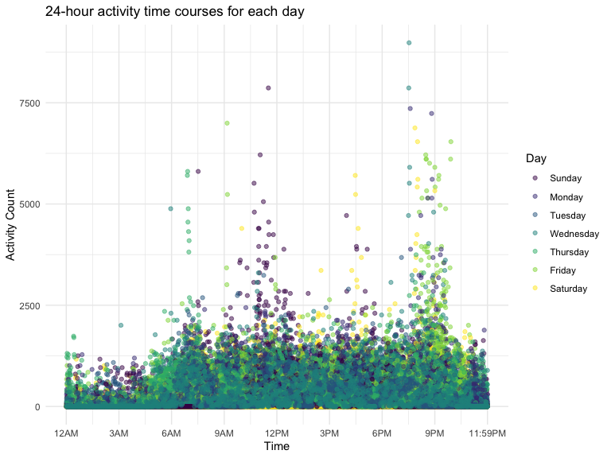

p8105_hw3_yj2687
================
Yijia Jiang
2022-10-07

## Problem 1 (Instacart dataset)

``` r
data("instacart")

instacart_df = 
  instacart %>% 
  as_tibble(instacart)

instacart_df %>% 
  count(aisle) %>% 
  arrange(desc(n))
```

    ## # A tibble: 134 × 2
    ##    aisle                              n
    ##    <chr>                          <int>
    ##  1 fresh vegetables              150609
    ##  2 fresh fruits                  150473
    ##  3 packaged vegetables fruits     78493
    ##  4 yogurt                         55240
    ##  5 packaged cheese                41699
    ##  6 water seltzer sparkling water  36617
    ##  7 milk                           32644
    ##  8 chips pretzels                 31269
    ##  9 soy lactosefree                26240
    ## 10 bread                          23635
    ## # … with 124 more rows

``` r
instacart_df %>% 
  count(aisle) %>% 
  filter(n > 10000) %>% 
  mutate(aisle = fct_reorder(aisle, n)) %>% 
  ggplot(aes(x = aisle, y = n)) + 
  geom_point() + 
  labs(title = "Number of items ordered in each aisle") +
  theme(axis.text.x = element_text(angle = 60, hjust = 1))
```


``` r
instacart %>% 
  filter(aisle %in% c("baking ingredients", "dog food care", "packaged vegetables fruits")) %>%
  group_by(aisle) %>% 
  count(product_name) %>% 
  mutate(rank = min_rank(desc(n))) %>% 
  filter(rank < 4) %>% 
  arrange(desc(n)) %>%
  knitr::kable()
```

| aisle                      | product_name                                  |    n | rank |
|:---------------------------|:----------------------------------------------|-----:|-----:|
| packaged vegetables fruits | Organic Baby Spinach                          | 9784 |    1 |
| packaged vegetables fruits | Organic Raspberries                           | 5546 |    2 |
| packaged vegetables fruits | Organic Blueberries                           | 4966 |    3 |
| baking ingredients         | Light Brown Sugar                             |  499 |    1 |
| baking ingredients         | Pure Baking Soda                              |  387 |    2 |
| baking ingredients         | Cane Sugar                                    |  336 |    3 |
| dog food care              | Snack Sticks Chicken & Rice Recipe Dog Treats |   30 |    1 |
| dog food care              | Organix Chicken & Brown Rice Recipe           |   28 |    2 |
| dog food care              | Small Dog Biscuits                            |   26 |    3 |

``` r
instacart %>%
  filter(product_name %in% c("Pink Lady Apples", "Coffee Ice Cream")) %>%
  group_by(product_name, order_dow) %>%
  summarize(mean_hour = mean(order_hour_of_day)) %>%
  spread(key = order_dow, value = mean_hour) %>%
  knitr::kable(digits = 2)
```

| product_name     |     0 |     1 |     2 |     3 |     4 |     5 |     6 |
|:-----------------|------:|------:|------:|------:|------:|------:|------:|
| Coffee Ice Cream | 13.77 | 14.32 | 15.38 | 15.32 | 15.22 | 12.26 | 13.83 |
| Pink Lady Apples | 13.44 | 11.36 | 11.70 | 14.25 | 11.55 | 12.78 | 11.94 |

 

## Problem 2 (Accelerometer dataset)

``` r
# Tidy the dataset
accel_df = read.csv("./p8105_hw3_data/accel_data.csv") %>%
  janitor::clean_names() %>%
  pivot_longer(activity_1:activity_1440, names_to = "minutes_in_a_day", 
               names_prefix = "activity_", values_to = "activity_count") %>% 
  mutate(weekday_vs_weekend = case_when(
    day == "Monday"  ~ "Weekday",
    day == "Tuesday"  ~ "Weekday",
    day == "Wednesday"  ~ "Weekday",
    day == "Thursday"  ~ "Weekday",
    day == "Friday"  ~ "Weekday",
    day == "Sunday"  ~ "Weekend",
    day == "Saturday"  ~ "Weekend"
  )) %>% 
  select(week, day_id, day, weekday_vs_weekend, everything()) %>% 
  mutate_if(is.double, as.integer) %>%
  mutate(minutes_in_a_day = as.integer(minutes_in_a_day))
```

-   There are 50400 observations in the resulting tidy dataset,
    including 6 variables, namely week, day_id, day, weekday_vs_weekend,
    minutes_in_a\_day, activity_count.

``` r
# Create a table showing total activity for each day by aggregating across minutes
accel_df$day = factor(accel_df$day, levels = c("Sunday", "Monday", "Tuesday", "Wednesday", "Thursday", "Friday", "Saturday"))

accel_df %>% 
  group_by(day) %>% 
  summarize(total = sum(activity_count)) %>% 
  knitr::kable(align = "l", format = "pipe", col.names = c("Day","Total"))
```

| Day       | Total   |
|:----------|:--------|
| Sunday    | 1919213 |
| Monday    | 1858545 |
| Tuesday   | 1798521 |
| Wednesday | 2129059 |
| Thursday  | 2090445 |
| Friday    | 2291448 |
| Saturday  | 1369237 |

-   It is difficult to identify the apparent trends across days
    according to this table, while we can see the total activity on
    Saturdays is much lower than that on other days and Friday has the
    highest total activity.

``` r
# Make a single-panel plot showing the 24-hour activity time courses for each day and use color to indicate day of the week. 
accel_df %>% 
  group_by(day, minutes_in_a_day) %>%
  rename(Day = day) %>%
  ggplot(aes(minutes_in_a_day, activity_count, color = Day)) +
  geom_point(alpha = 0.5) +
  scale_x_continuous(
    breaks = c(0, 180, 360, 540, 720, 900, 1080, 1260, 1440),
    labels = c("12AM", "3AM", "6AM", "9AM", "12PM", "3PM", "6PM", "9PM", "11:59PM")) + 
  labs(
    title = "24-hour activity time courses for each day",
    x = "Time",
    y = "Activity Count") +
  theme(legend.position = "right")
```



-   We can see that most of the activity count for every minute
    throughout the day is usually below 2500. The activity count at noon
    and evenings tends to peak compared to the other time of the day.

 
