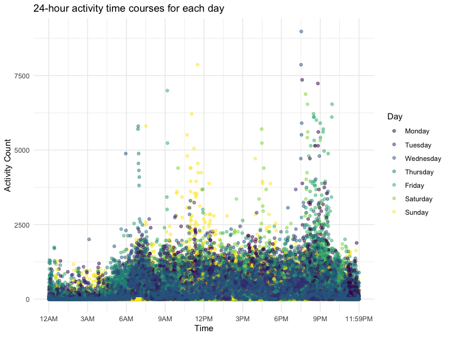

p8105_hw3_yj2687
================
Yijia Jiang
2022-10-07

## Problem 1 (Instacart dataset)

``` r
data("instacart")

instacart_df = 
  instacart %>% 
  as_tibble(instacart)
```

``` r
# Create a table summarizing the number of items ordered from aisle.
instacart_df %>% 
  count(aisle) %>% 
  arrange(desc(n))
```

    ## # A tibble: 134 × 2
    ##    aisle                              n
    ##    <chr>                          <int>
    ##  1 fresh vegetables              150609
    ##  2 fresh fruits                  150473
    ##  3 packaged vegetables fruits     78493
    ##  4 yogurt                         55240
    ##  5 packaged cheese                41699
    ##  6 water seltzer sparkling water  36617
    ##  7 milk                           32644
    ##  8 chips pretzels                 31269
    ##  9 soy lactosefree                26240
    ## 10 bread                          23635
    ## # … with 124 more rows

``` r
# Make a plot showing the number of items ordered in each aisle. 
instacart_df %>% 
  count(aisle) %>% 
  filter(n > 10000) %>% 
  mutate(aisle = fct_reorder(aisle, n)) %>% 
  ggplot(aes(x = aisle, y = n)) + 
  geom_point() + 
  labs(title = "Number of items ordered in each aisle") +
  theme(axis.text.x = element_text(angle = 60, hjust = 1))
```


``` r
# Create a table shows the three most popular items in aisles `baking ingredients`, `dog food care`, and `packaged vegetables fruits`
instacart %>% 
  filter(aisle %in% c("baking ingredients", "dog food care", "packaged vegetables fruits")) %>%
  group_by(aisle) %>% 
  count(product_name) %>% 
  mutate(rank = min_rank(desc(n))) %>% 
  filter(rank < 4) %>% 
  arrange(desc(n)) %>%
  knitr::kable()
```

| aisle                      | product_name                                  |    n | rank |
|:---------------------------|:----------------------------------------------|-----:|-----:|
| packaged vegetables fruits | Organic Baby Spinach                          | 9784 |    1 |
| packaged vegetables fruits | Organic Raspberries                           | 5546 |    2 |
| packaged vegetables fruits | Organic Blueberries                           | 4966 |    3 |
| baking ingredients         | Light Brown Sugar                             |  499 |    1 |
| baking ingredients         | Pure Baking Soda                              |  387 |    2 |
| baking ingredients         | Cane Sugar                                    |  336 |    3 |
| dog food care              | Snack Sticks Chicken & Rice Recipe Dog Treats |   30 |    1 |
| dog food care              | Organix Chicken & Brown Rice Recipe           |   28 |    2 |
| dog food care              | Small Dog Biscuits                            |   26 |    3 |

``` r
# Create a table showing the mean hour of the day at which Pink Lady Apples and Coffee Ice Cream are ordered on each day of the week.
instacart %>%
  filter(product_name %in% c("Pink Lady Apples", "Coffee Ice Cream")) %>%
  group_by(product_name, order_dow) %>%
  summarize(mean_hour = mean(order_hour_of_day)) %>%
  spread(key = order_dow, value = mean_hour) %>%
  knitr::kable(digits = 2)
```

| product_name     |     0 |     1 |     2 |     3 |     4 |     5 |     6 |
|:-----------------|------:|------:|------:|------:|------:|------:|------:|
| Coffee Ice Cream | 13.77 | 14.32 | 15.38 | 15.32 | 15.22 | 12.26 | 13.83 |
| Pink Lady Apples | 13.44 | 11.36 | 11.70 | 14.25 | 11.55 | 12.78 | 11.94 |

-   This resulting dataset contains 1384617 rows and 15 columns, with
    each row resprenting a single product from an instacart order.
    Variables include identifiers for user, order, and product; the
    order in which each product was added to the cart. There are several
    order-level variables, describing the day and time of the order, and
    number of days since prior order. Then there are several
    item-specific variables, describing the product name (e.g. Yogurt,
    Avocado), department (e.g. dairy and eggs, produce), and aisle
    (e.g. yogurt, fresh fruits), and whether the item has been ordered
    by this user in the past. In total, there are 39123 products found
    in 131209 orders from 131209 distinct users.
-   In total, there are 134 aisles, with fresh vegetables and fresh
    fruits holding the most items ordered by far.
-   From the last table, we can know that Pink Lady Apples are generally
    purchased slightly earlier in the day than Coffee Ice Cream, with
    the exception of day 5.

 

## Problem 2 (Accelerometer dataset)

``` r
# Tidy the dataset
accel_df = read.csv("./p8105_hw3_data/accel_data.csv") %>%
  janitor::clean_names() %>%
  pivot_longer(activity_1:activity_1440, names_to = "minutes_in_a_day", 
               names_prefix = "activity_", values_to = "activity_count") %>% 
  mutate(day = day %>% 
           fct_relevel("Monday", "Tuesday", "Wednesday","Thursday","Friday", "Saturday","Sunday")) %>% 
  mutate(weekday_vs_weekend = case_when(
    day == "Monday"  ~ "Weekday",
    day == "Tuesday"  ~ "Weekday",
    day == "Wednesday"  ~ "Weekday",
    day == "Thursday"  ~ "Weekday",
    day == "Friday"  ~ "Weekday",
    day == "Sunday"  ~ "Weekend",
    day == "Saturday"  ~ "Weekend"
  )) %>% 
  select(week, day_id, day, weekday_vs_weekend, everything()) %>% 
  mutate(minutes_in_a_day = as.integer(minutes_in_a_day))
```

-   There are 50400 observations in the resulting tidy dataset,
    including 6 variables, namely week, day_id, day, weekday_vs_weekend,
    minutes_in_a\_day, activity_count.

``` r
# Create a table showing total activity for each day by aggregating across minutes
accel_df %>% 
  group_by(week,day) %>% 
  summarize(total = sum(activity_count)) %>% 
  spread(key = day,total) %>% 
  knitr::kable(align = "l", digits = 0)
```

| week | Monday | Tuesday | Wednesday | Thursday | Friday | Saturday | Sunday |
|:-----|:-------|:--------|:----------|:---------|:-------|:---------|:-------|
| 1    | 78828  | 307094  | 340115    | 355924   | 480543 | 376254   | 631105 |
| 2    | 295431 | 423245  | 440962    | 474048   | 568839 | 607175   | 422018 |
| 3    | 685910 | 381507  | 468869    | 371230   | 467420 | 382928   | 467052 |
| 4    | 409450 | 319568  | 434460    | 340291   | 154049 | 1440     | 260617 |
| 5    | 389080 | 367824  | 445366    | 549658   | 620860 | 1440     | 138421 |

-   It is difficult to identify the apparent trends across days
    according to this table, while we can see the total activity on week
    4 and week 5 Saturdays is much lower than that on the other days.

``` r
# Make a single-panel plot showing the 24-hour activity time courses for each day and use color to indicate day of the week. 
accel_df %>% 
  group_by(day, minutes_in_a_day) %>%
  rename(Day = day) %>%
  ggplot(aes(minutes_in_a_day, activity_count, color = Day)) +
  geom_point(alpha = 0.5) +
  scale_x_continuous(
    breaks = c(0, 180, 360, 540, 720, 900, 1080, 1260, 1440),
    labels = c("12AM", "3AM", "6AM", "9AM", "12PM", "3PM", "6PM", "9PM", "11:59PM")) + 
  labs(
    title = "24-hour activity time courses for each day",
    x = "Time",
    y = "Activity Count") +
  theme(legend.position = "right")
```



-   We can see that most of the activity count for every minute
    throughout the day is usually below 2500. The activity count at noon
    (12PM) and evenings (9PM) tends to reach the peak compared to the
    other time of the day, and the activity count tends to be very low
    between the period \[12AM, 6AM\] across days as people normally
    sleep during this time. In terms of point dispersion, there are more
    activity counts per minute on Friday and Wednesday.

 

## Problem 3 (NY NOAA dataset)

``` r
# Tidy the dataset
noaa_df = ny_noaa %>% 
  janitor::clean_names() %>%
  separate(date, into = c("year", "month", "day")) %>% 
  arrange(year, month) %>%
  mutate(year = as.numeric(year),
         month = month.name[as.numeric(month)],
         day = as.numeric(day)) %>%
  mutate(prcp = prcp/10,
         tmax = (as.numeric(tmax)/10),
         tmin = (as.numeric(tmin)/10)) 
```

-   This data collected weather data from all New York state weather
    stations between 1981 and 2010.
-   There are 2595176 observations in the resulting tidied dataset,
    including 9 variables, namely id, year, month, day, prcp, snow,
    snwd, tmax, tmin.
-   The units for `prcp`, `snow`, `snwd` are unified as “Millimeter”
    (mm), and the unit for `tmax` and `tmin` are unified as “Celsius”
    (C).
-   The `id` is a character variable, the `year`, `month`, `day` are
    numeric variables, and `prcp`, `snow`, `snwd`, `tmax`, `tmin` are
    numeric variables.
-   Interestingly, before tidy procedure, the variables `tmax` and
    `tmin` were defined as a character, the `snow` variable has a
    negative value of -13 mm.
-   There exist 145838 missing values in `prcp`, 381221 missing values
    in `snow`, 591786 missing values in `snwd`, 1134358 missing values
    in `tmax` and 1134420 missing values in `tmin`, accounting for
    5.62%, 14.69%, 22.80%, 43.71% and 43.71%, respectively. The issues
    for missing values cannot be ignored as some of the proportion is
    very large, nearly close to 50%.

``` r
# Count the most commonly values for snowfall
snow_obs = noaa_df %>%
  count(snow) %>% 
  arrange(desc(n))
snow_obs
```

    ## # A tibble: 282 × 2
    ##     snow       n
    ##    <int>   <int>
    ##  1     0 2008508
    ##  2    NA  381221
    ##  3    25   31022
    ##  4    13   23095
    ##  5    51   18274
    ##  6    76   10173
    ##  7     8    9962
    ##  8     5    9748
    ##  9    38    9197
    ## 10     3    8790
    ## # … with 272 more rows

-   For snowfall, the most commonly observed value is 0 mm. This is
    because it seldom snow in New York owing to the geographical
    location.

``` r
# Make a two-panel plot showing the average max temperature in January and in July in each station across years.
jan_vs_july = noaa_df %>%
  filter(!is.na(tmax), month %in% c("January", "July")) %>%
  group_by(id, year, month) %>%
  summarise(average_tmax = mean(tmax))

# Scatterplot
jan_vs_july %>% 
  ggplot(aes(x = year, y = average_tmax)) +
  geom_point(alpha = .5) +
  geom_smooth() +
  facet_grid(. ~ month) +
  labs(
    title = "Average max temperature in January and in July in each station across years",
    x = "Year",
    y = "Average Maximum Temperature (C)",
    caption = "Data from the noaa package") 
```


-   This two-panel scatter plot compares the average maximum temperature
    in January and in July in each station across years. We can observe
    that the average highest temperature in January is much lower than
    that in July across 30 years. This is because January is winter and
    July is summer for New York. Additionally, the fluctuation of
    maximum temperature in January is larger than that in July, in a
    wavy pattern, first decreasing year by year and then beginning to
    rise year by year. Relatively, the maximum temperatures vary less in
    July. For both months, there are outliers present across the years,
    the average max temperature in 1988 July is abnormally low.

``` r
# Make a plot showing tmax vs tmin for the full dataset
# Hex plot
p1= noaa_df %>%
  filter(!is.na(tmin), !is.na(tmax)) %>%
  ggplot(aes(x = tmin, y = tmax)) +
  geom_hex() +
  labs(
    title = "Max and min temperature comparison",
    x = "Max temperature (C)",
    y = "Min temperature (C)") +
  theme(legend.title = element_text(size = 9), 
        legend.text  = element_text(size = 5))

# Make a plot showing the distribution of snowfall values greater than 0 and less than 100 separately by year
p2 = noaa_df %>% 
  filter(snow > 0 & snow < 100) %>%
  ggplot(aes(x = snow, y = as.factor(year))) +
  geom_density_ridges(scale = 0.7) +
  labs(
    title = "The distribution of snowfall",
    x = "Snowfall (mm)",
    y = "Year",
    caption = "Data from the noaa package") 

# Two-panel layout
p1+p2
```


-   A two-panel plot is created by combining the hex plot and the
    density ridge plot, showing the comparison between the maximum
    temperature and the minimum temperature, and the distribution of
    snowfall values greater than 0 and less than 100 separately by year.
    From the hex plot, we observe that there is a positive correlation
    between the maximum temperature and the minimum temperature and the
    temperature is around 0 to 25 degrees for most of the time. From the
    density ridge plot, we observe similar pattern of snowfall
    distribution across years by excluding the values less than 0 and
    more than 100. Most of the snowfall has the value ranging from 10 mm
    to 30 mm, with some falling as much as 50 mm.
